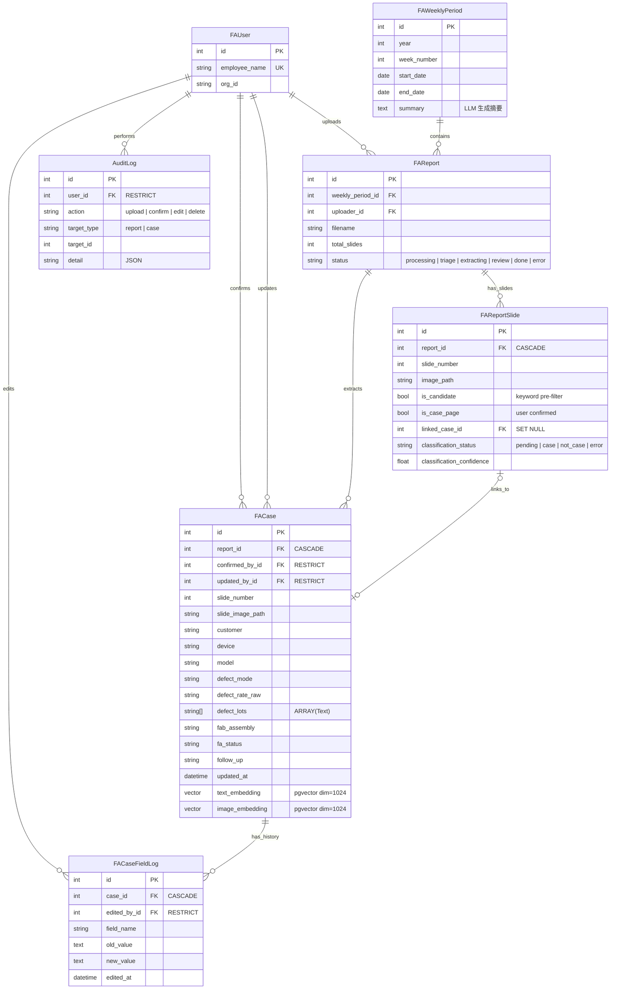

# QVault

FA 案例管理平台。自動從 PowerPoint 周報中提取失效分析案例資料，存入資料庫供搜尋、編輯與管理。

## 功能

- **上傳周報**：拖放上傳 `.pptx` 周報，選擇所屬周次（支援歷史報告補登）
- **自動提取**：VLM 自動辨識案例頁，提取 10 個標準欄位
- **預篩選**：先用關鍵字過濾非案例頁（首頁、摘要頁），減少 VLM 呼叫
- **審核機制**：先審後存，提取結果可在線編輯修正後再存入資料庫
- **即時進度**：SSE 推送處理進度，前端即時顯示
- **案例管理**：Excel 風格表格直接 inline 編輯，欄位級修改記錄追蹤
- **案例搜尋**：全文搜尋 + 欄位篩選（客戶、Device、周次）
- **語義搜尋**：文字與圖片 embedding（pgvector），支援相似案例推薦
- **週報摘要**：每週報告確認後，LLM 自動生成本周重點摘要
- **完整投影片保留**：所有頁面（含非案例頁）的圖片、PDF 和記錄皆保留
- **權限控管**：基於 JWT scope 的三級權限（read / write / admin）
- **操作稽核**：上傳、確認、編輯、刪除操作皆記錄於 audit log

## 提取欄位

| 欄位 | 說明 | 備註 |
|---|---|---|
| Date | 案例日期 | 自動清洗雜訊如 `[13829]` |
| Customer | 客戶名稱 | 可含層級如 `客戶A > 客戶B` |
| Device | 內部產品型號 | |
| Model | 客戶機種名稱 | |
| Defect Mode | 失效模式 | 別名：Defect Phenomenon |
| Defect Rate | 不良率 | 保留原始格式如 `2ea`, `4583dppm` |
| Defect Lots | 不良批號 | 多個 Lot ID |
| FAB/Assembly | 工廠名稱/代碼 | |
| FA Status | 分析狀態 | |
| Follow Up | 後續行動 | |

## 處理流程

```
上傳 .pptx → LibreOffice 轉 PDF → pdftoppm 轉逐頁 PNG → 關鍵字預篩選
    → VLM 分類 (Stage 1) → 使用者分類確認 (Triage)
    → VLM 結構化提取 (Stage 2, 並行 + 重試) → 資料清洗
    → 審核 UI (inline edit) → 確認存入 fa_cases
    → 生成 text/image embedding → 生成週報摘要
    → 操作寫入 audit_logs
```

## 資料模型



### 檔案儲存

上傳的 PPTX 原始檔、轉換後的 PDF、以及所有投影片圖片皆保留在檔案系統，資料庫存相對路徑：

```
uploads/images/{report_id}/
  ├── weekly_report_w11.pptx      ← 原始 PPTX（保留）
  ├── weekly_report_w11.pdf       ← 轉換後 PDF（保留，供預覽/下載）
  ├── slide-01.png                ← 所有頁面的 PNG（含非案例頁）
  ├── slide-02.png
  ├── ...
  └── extraction_results.json     ← VLM 提取結果（審核用）
```

FastAPI 透過 `StaticFiles(directory=uploads_dir)` mount 在 `/uploads` 路徑，前端以 `/uploads/images/{report_id}/slide-XX.png` 存取圖片。

每頁投影片在 `fa_report_slides` 表中都有對應記錄，案例頁透過 `linked_case_id` 連結到 `fa_cases`。

### 認證架構

```
Browser → Nginx (:80)
    ├── /oauth2/*    → oauth2-proxy (:4180)   ← 登入/登出/callback
    ├── /auth/login  → App (:8000)            ← 登入頁面（免驗）
    └── /*           → auth_request /oauth2/auth
                     → Authorization: Bearer <JWT>
                     → App (:8000)
```

oauth2-proxy 處理完整 OAuth 2.0 OIDC 流程（Auth Center），Nginx 透過 `auth_request` 驗證後將 JWT 注入 `Authorization` header，App 只做 JWT 驗簽與 scope 檢查。

### 權限模型

基於 Auth Center JWT `scopes` 欄位的三級權限：

| 等級 | Scope | 可執行操作 |
|------|-------|-----------|
| 唯讀 | `read` | 瀏覽案例、搜尋、查看周報 |
| 讀寫 | `read`, `write` | 上傳周報、確認/編輯/刪除案例 |
| 管理 | `read`, `write`, `admin` | 保留供未來管理功能使用 |

開發模式（`DEV_SKIP_AUTH=true`）自動給予全部 scope。

### 操作稽核

所有寫入操作記錄在 `audit_logs` 表，欄位級變更另存於 `fa_case_field_logs`：

| 操作 | 記錄內容 |
|------|---------|
| `upload` | 檔名、年/周、是否覆蓋 |
| `confirm` | report_id、slide_number |
| `edit` | 變更欄位的 old/new 值（audit_logs + fa_case_field_logs） |
| `delete` | 刪除前的 case 關鍵欄位快照 |

## 技術棧

| 層 | 技術 |
|---|---|
| 後端 | FastAPI |
| 前端 | Jinja2 + HTMX + TailwindCSS (CDN) + Material Icons |
| 資料庫 | PostgreSQL + pgvector |
| 認證 | oauth2-proxy + Auth Center (OIDC, JWT RS256) |
| PPTX 解析 | python-pptx + LibreOffice + poppler-utils |
| VLM | vLLM (OpenAI-compatible API) |
| Embedding | vLLM `/v1/embeddings` |
| 進度推送 | SSE (Server-Sent Events) |
| 套件管理 | uv |
| 部署 | Docker Compose + systemd (user-level) + Nginx |

## 專案結構

```
qvault/
├── app/
│   ├── main.py                    # FastAPI 入口 + lifespan
│   ├── core/
│   │   ├── config.py              # 環境設定 (pydantic-settings)
│   │   ├── auth.py                # JWT 驗簽 / scope 檢查（oauth2-proxy 處理 OAuth flow）
│   │   └── logging_config.py      # Loguru 日誌設定
│   ├── models/
│   │   ├── database.py            # AsyncSession
│   │   └── fa_case.py             # SQLAlchemy models
│   ├── schemas/
│   │   └── fa_case.py             # Pydantic schemas
│   ├── routers/
│   │   ├── auth.py                # 登入頁 / oauth2-proxy 重導
│   │   ├── upload.py              # 上傳 + SSE 進度 + 投影片記錄
│   │   ├── triage.py              # Stage 1 分類確認
│   │   ├── cases.py               # 案例 CRUD + 語義搜尋 + 稽核
│   │   └── pages.py               # 頁面渲染
│   ├── services/
│   │   ├── pptx_parser.py         # PPTX → PDF → PNG + 預篩選
│   │   ├── vlm_extractor.py       # VLM 分類 + 結構化提取
│   │   ├── data_cleaner.py        # 欄位清洗
│   │   ├── embedding.py           # Text/Image embedding 生成
│   │   ├── weekly_summary.py      # LLM 週報摘要生成
│   │   ├── audit.py               # 操作稽核 log_action()
│   │   └── image_utils.py         # 圖片 base64 工具
│   └── templates/                 # Jinja2 HTML 模板
├── alembic/versions/
│   ├── 001_initial_schema.py      # 基礎四表 + pgvector
│   ├── 002_add_confirmed_by.py    # fa_cases.confirmed_by_id
│   ├── 003_add_audit_logs.py      # audit_logs 稽核表
│   ├── 004_add_report_slides.py   # fa_report_slides 投影片記錄
│   ├── 005_add_triage_fields.py   # VLM 分類欄位
│   ├── 006_add_case_edit_tracking.py  # 欄位級修改記錄
│   └── 007_add_weekly_period_summary.py # 週報摘要
├── keys/
│   └── public.pem                 # Auth Center RS256 公鑰（不入版控）
├── tests/                         # pytest 測試
├── screenshots/                   # UI 截圖
├── deploy/
│   ├── setup.sh                   # 一鍵部署腳本（互動式）
│   ├── docker-compose.yml         # PostgreSQL + oauth2-proxy
│   ├── .env.example               # Docker Compose 環境變數範本
│   ├── qvault.service             # systemd user service
│   ├── nginx.conf                 # Nginx 模板（含 auth_request）
│   └── INSTALL.md                 # 完整部署指南
├── .env.example
└── pyproject.toml
```

## 環境變數

所有設定皆可透過 `.env` 檔案或環境變數覆蓋（參見 `.env.example`）：

| 類別 | 變數 | 說明 |
|------|------|------|
| 資料庫 | `DATABASE_URL` | PostgreSQL 連線字串 |
| VLM | `VLM_BASE_URL`, `VLM_API_KEY`, `VLM_MODEL`, `VLM_EMBEDDING_MODEL` | vLLM 伺服器設定 |
| VLM 處理 | `VLM_MAX_CONCURRENCY`, `VLM_RETRY_COUNT` | 並行度與重試 |
| VLM Sampling | `VLM_TEMPERATURE`, `VLM_TOP_P`, `VLM_TOP_K`, `VLM_MIN_P`, `VLM_PRESENCE_PENALTY`, `VLM_REPETITION_PENALTY` | 推論參數 |
| 上傳 | `UPLOAD_DIR`, `MAX_UPLOAD_SIZE_MB` | 檔案儲存位置與大小限制 |
| 認證 | `AUTH_PUBLIC_KEY_PATH`, `DEV_SKIP_AUTH` | JWT 公鑰路徑、開發模式跳過驗證 |

## 快速開始

```bash
# 安裝依賴
uv sync

# 設定環境變數
cp .env.example .env
# 編輯 .env（至少設定 DATABASE_URL 和 VLM 位址）

# 資料庫遷移
uv run alembic upgrade head

# 啟動開發伺服器（跳過 OAuth 驗證）
DEV_SKIP_AUTH=true uv run fastapi run app/main.py

# 或使用 uvicorn（支援 --reload）
uv run uvicorn app.main:app --reload
```

完整部署（含 oauth2-proxy + PostgreSQL Docker）請執行 `bash deploy/setup.sh`，詳見 [deploy/INSTALL.md](deploy/INSTALL.md)。
