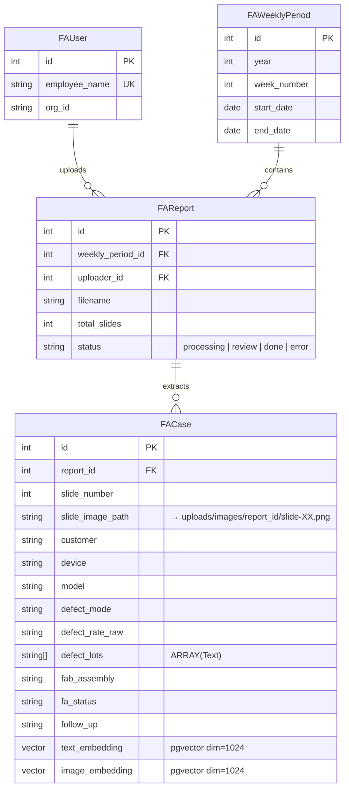

# FA Insight Harvester

失效分析 (FA) 周報結構化提取系統。自動從 PowerPoint 周報中提取 FA 案例資料，存入資料庫供搜尋與管理。

## 功能

- **上傳周報**：拖放上傳 `.pptx` 周報，選擇所屬周次
- **自動提取**：VLM 自動辨識案例頁，提取 10 個標準欄位
- **預篩選**：先用關鍵字過濾非案例頁（首頁、摘要頁），減少 VLM 呼叫
- **審核機制**：先審後存，提取結果可在線編輯修正後再存入資料庫
- **即時進度**：SSE 推送處理進度，前端即時顯示
- **案例搜尋**：全文搜尋 + 欄位篩選（客戶、Device、周次）
- **Embedding**：文字與圖片 embedding，支援語義搜尋（pgvector）

## 提取欄位

| 欄位 | 說明 | 備註 |
|---|---|---|
| Date | 案例日期 | 自動清洗雜訊如 `[13829]` |
| Customer | 客戶名稱 | 可含層級如 `客戶A > 客戶B` |
| Device | 內部產品型號 | |
| Model | 客戶機種名稱 | |
| Defect Mode | 失效模式 | 別名：Defect Phenomenon |
| Defect Rate | 不良率 | 保留原始格式如 `2ea`, `4583dppm` |
| Defect Lots | 不良批號 | 多個 Lot ID |
| FAB/Assembly | 工廠名稱/代碼 | |
| FA Status | 分析狀態 | |
| Follow Up | 後續行動 | |

## 處理流程

```
上傳 .pptx → LibreOffice 轉逐頁 PNG → 關鍵字預篩選
    → VLM 結構化提取 (並行 + 重試) → 資料清洗
    → 審核 UI (inline edit) → 確認存入 PostgreSQL
    → 生成 text/image embedding
```

## 資料模型



### 圖片儲存

投影片圖片存放在檔案系統，資料庫只存相對路徑：

```
uploads/images/{report_id}/
  ├── slide-01.png      ← FACase.slide_image_path = "images/{report_id}/slide-01.png"
  ├── slide-02.png
  └── extraction_results.json   ← 暫存 VLM 提取結果供審核
```

FastAPI 透過 `StaticFiles(directory=uploads_dir)` mount 在 `/uploads` 路徑，前端以 `/uploads/images/{report_id}/slide-XX.png` 存取圖片。

## 技術棧

| 層 | 技術 |
|---|---|
| 後端 | FastAPI |
| 前端 | Jinja2 + HTMX + TailwindCSS (CDN) + Material Icons |
| 資料庫 | PostgreSQL + pgvector |
| 認證 | OAuth 2.0 (Auth Center, JWT RS256) |
| PPTX 解析 | python-pptx + LibreOffice + poppler-utils |
| VLM | vLLM (OpenAI-compatible API) |
| Embedding | vLLM `/v1/embeddings` |
| 進度推送 | SSE (Server-Sent Events) |
| 套件管理 | uv |
| 部署 | systemd (user-level) + Nginx |

## 專案結構

```
fa-insight-harvester/
├── app/
│   ├── main.py                    # FastAPI 入口
│   ├── core/
│   │   ├── config.py              # 環境設定 (pydantic-settings)
│   │   ├── auth.py                # OAuth 2.0 認證 / JWT 驗簽
│   │   └── logging_config.py      # Loguru 日誌設定
│   ├── models/
│   │   ├── database.py            # AsyncSession
│   │   └── fa_case.py             # SQLAlchemy models
│   ├── schemas/
│   │   └── fa_case.py             # Pydantic schemas
│   ├── routers/
│   │   ├── auth.py                # 登入頁 / OAuth 回呼
│   │   ├── upload.py              # 上傳 + SSE 進度
│   │   ├── cases.py               # 案例 CRUD + 搜尋
│   │   └── pages.py               # 頁面渲染
│   ├── services/
│   │   ├── pptx_parser.py         # PPTX 解析 + 預篩選
│   │   ├── vlm_extractor.py       # VLM 提取
│   │   ├── data_cleaner.py        # 欄位清洗
│   │   ├── embedding.py           # Embedding 生成
│   │   └── image_utils.py         # 圖片 base64 工具
│   └── templates/                 # Jinja2 HTML 模板
├── alembic/                       # DB migration
├── deploy/
│   ├── setup.sh                   # 一鍵部署腳本
│   ├── fa-insight-harvester.service
│   └── nginx.conf
├── .env.example
└── pyproject.toml
```

## 快速開始

```bash
# 安裝依賴
uv sync

# 設定環境變數
cp .env.example .env
# 編輯 .env

# 資料庫遷移
uv run alembic upgrade head

# 啟動開發伺服器（跳過 OAuth 驗證）
DEV_SKIP_AUTH=true uv run fastapi run app/main.py

# 或使用 uvicorn（支援 --reload）
uv run uvicorn app.main:app --reload
```

完整部署請執行 `bash deploy/setup.sh`（自動建立 Docker PostgreSQL、安裝依賴、設定 systemd + nginx）。
